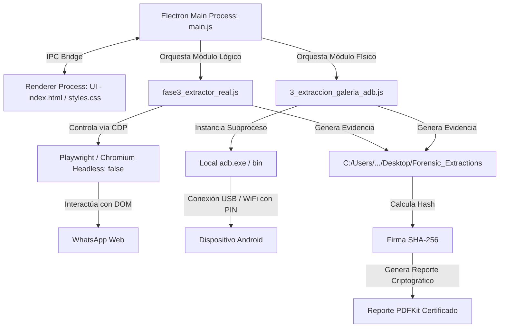

# 🧠 AI Context & Business Blueprint: Forensic Data Extractor Suite
> **Propósito:** Este documento consolida todo el conocimiento técnico, estratégico, forense y comercial de la suite **Forensic Data Extractor Suite**. Está diseñado específicamente para ser subido a ChatGPT, Claude u otra IA, de modo que entienda instantáneamente el contexto del negocio, el funcionamiento del software, la arquitectura, los aspectos legales de la evidencia y las estrategias de marketing en una sola sesión de análisis estratégico multi-servicio.

---

## 📋 1. Información General y Resumen del Producto

### ¿Qué es Forensic Data Extractor Suite?
**Forensic Data Extractor Suite** (o *Forensic Suite*) es una aplicación de escritorio nativa e híbrida (.EXE) especializada en la **adquisición, preservación e integridad criptográfica de evidencia digital**. Diseñada bajo los estándares de informática forense internacional (como las directrices del FBI y la norma NOM-151-SCFI-2016 en México), la herramienta automatiza la extracción de datos lógicos y físicos de dos entornos críticos:
1.  **Entorno Web (Módulo Lógico):** Extracción automatizada del historial completo de conversaciones de **WhatsApp Web** en orden cronológico, descargando elementos multimedia y generando registros en formato estructurado (CSV).
2.  **Entorno Móvil (Módulo Físico):** Extracción automatizada vía **ADB (Android Debug Bridge)** de almacenamiento móvil crítico (Galería de la Cámara DCIM, Carpetas de Imágenes, Descargas, e Imágenes/Videos nativos de la aplicación WhatsApp en Android).

Todo el flujo operativo está unificado dentro de una interfaz de usuario visual premium con estética de **Cyber-Forensic Dashboard** desarrollada con **HTML, Javascript (Vanilla) y CSS**, empaquetada como ejecutable de escritorio portable mediante **Electron**.

### ¿Qué problemas resuelve? (Dolores del Mercado)
1.  **Inadmisibilidad de Capturas de Pantalla (Screenshots):** En la actualidad, presentar simples capturas de pantalla de WhatsApp como evidencia en un juicio civil, laboral o penal es altamente vulnerable. Un abogado de la contraparte puede argumentar fácilmente que las imágenes fueron manipuladas con Photoshop o editadas alterando el código fuente del DOM de WhatsApp Web mediante "Inspeccionar Elemento".
2.  **Ruptura de la Cadena de Custodia:** Extraer conversaciones copiando y pegando texto a un documento de Word o moviendo fotos manualmente de un celular a una computadora desprovista de hashes criptográficos rompe la cadena de custodia. Esto invalida inmediatamente la prueba en tribunales.
3.  **Complejidad Operativa de las Herramientas Forenses Clásicas:** Herramientas comerciales de grado militar (como *Cellebrite UFED* o *Magnet AXIOM*) son extremadamente costosas (licencias anuales de miles de dólares) y requieren certificaciones técnicas profundas, poniéndolas fuera del alcance de abogados corporativos, agencias de investigación privada y peritos independientes de menor escala.
4.  **Límites de Sincronización de WhatsApp Web:** WhatsApp Web solo sincroniza aproximadamente el último año de historial de chat de forma nativa. Acceder a evidencias más antiguas requiere interactuar directamente con el dispositivo físico, un proceso manual propenso a errores humanos o alteración accidental de metadatos.

### ¿Qué soluciones aporta? (Alivios del Negocio)
1.  **Sello Criptográfico Inalterable (SHA-256):** El sistema calcula la huella criptográfica SHA-256 en caliente de manera instantánea tras realizar cada extracción (del archivo CSV y de cada imagen, audio o video extraído). Cualquier intento posterior de modificar una sola letra, coma o píxel alterará irreversiblemente el hash, probando matemáticamente que la evidencia no ha sido manipulada.
2.  **Reportes Certificados PDF Automatizados (PDFKit):** Tras finalizar la extracción, el software autogenera un documento PDF oficial y formal con formato de **Certificado de Extracción Forense**, registrando la fecha/hora UTC exacta, la herramienta utilizada, el nombre del archivo extraído y su firma SHA-256 correspondiente. Este PDF sirve como el entregable pericial directo para presentar ante un juez o notario público.
3.  **Doble Vector de Extracción (Lógico + Físico):**
    *   *Fase Lógica (WhatsApp Web):* Ejecuta un navegador Playwright controlado por código que realiza scrolls invertidos automáticos, extrae el texto nativo mediante metadatos incrustados (`data-pre-plain-text`) que identifican con precisión al autor real (número telefónico o nombre) y el timestamp de origen.
    *   *Fase Física (ADB Local):* Permite la extracción automatizada y recursiva de fotos y videos nativos del almacenamiento del celular (incluso vía WiFi inalámbrico con emparejamiento por PIN), asegurando la recuperación completa de metadatos EXIF de imágenes (como coordenadas GPS y fecha real de captura).
4.  **Experiencia Portable e Independiente:** Empaquetado en Electron, encapsula las dependencias de Node.js y Playwright. Incluye un directorio `bin` que aloja el binario de `adb.exe`, permitiendo que el analista corra el software en cualquier máquina Windows sin necesidad de configuraciones técnicas o instalaciones externas de Android SDK.

---

## 🛠️ 2. Arquitectura del Sistema e Integración de Electron

La arquitectura de **Forensic Data Extractor Suite** está diseñada para operar de forma 100% local (Edge Computing), garantizando que ninguna evidencia del caso se suba a internet, asegurando la privacidad absoluta de los datos periciales.



### Componentes de la Arquitectura

1.  **Frontend Ciberforense (Vanilla HTML5 / CSS3 / ES6):**
    *   Proporciona un entorno visual inmersivo basado en tonos oscuros profundos (`#0b0f19`), acentos cian/esmeralda, paneles translúcidos con efecto glassmorphism y una terminal de logs interactiva que muestra el avance detallado bit a bit.
    *   Dispone de una pantalla de bloqueo integrada para **Activación de Licencia** y vistas dedicadas para la Extracción Física (ADB), Auditoría Lógica (WhatsApp) y Ajustes del Sistema.
2.  **Middleware e Interfaz de Comunicación (Electron - `main.js` y `renderer.js`):**
    *   **IPC Bridge:** Utiliza llamadas asíncronas (`ipcRenderer.send` e `ipcMain.on`) para que la interfaz web solicite el arranque de los módulos y reciba los eventos en caliente.
    *   **Administrador de Ventanas:** Define límites estrictos de tamaño para preservar la consistencia visual y oculta el menú del sistema por defecto para dar un aspecto de software nativo cerrado muy profesional.
3.  **Motor Lógico (Playwright Core - `fase3_extractor_real.js`):**
    *   Levanta un navegador de forma persistente y visible (`headless: false`) para que el usuario pueda escanear su código QR si la sesión expira o verificar visualmente qué está haciendo el bot.
    *   Monitorea la carga, busca los contactos específicos seleccionados en la UI, simula desplazamientos (scrolls) de pantalla hacia arriba e interactúa con el botón de "mensajes antiguos" (*older messages*) si WhatsApp Web suspende la carga del chat.
4.  **Motor de Interfaz de Hardware (ADB Core - `3_extraccion_galeria_adb.js`):**
    *   Gestiona la comunicación por cable USB o red local (WiFi de depuración de Android) levantando subprocesos hijos de `adb.exe`.
    *   Implementa flujos de emparejamiento dinámicos inyectando el código PIN de sincronización en tiempo real vía `stdin` de la consola de Windows.
    *   Ejecuta comandos de listado (`ls -1p`) y descarga recursiva (`pull`) del árbol de directorios de almacenamiento en Android.

---

## 🛡️ 3. Mecanismo Forense de Integridad y Cadena de Custodia

Para cumplir con los más altos estándares legales de admisibilidad de evidencias, la suite incorpora tres capas de protección de datos:

### A. Extracción en Caliente y Hashing SHA-256 Inmediato
En informática forense, el tiempo entre la captura del dato y el cálculo de su firma criptográfica debe tender a cero.
*   **Para Chats de Texto:** Conforme Playwright extrae los mensajes del DOM y los escribe en el archivo CSV local, el sistema ejecuta la función `generarHash(rutaCSV)`. El valor hash resultante se pasa como argumento de entrada al motor de PDFKit para que sea imposible generar el certificado sin la firma del archivo de datos.
*   **Para Archivos Físicos (Imágenes/Videos):** El módulo ADB descarga los elementos en su formato y peso original sin ningún tipo de compresión o procesamiento. Acto previo, recorre recursivamente el directorio de salida generando el hash individual de cada archivo peritado.

### B. Generación Automatizada del Certificado Forense (PDFKit)
El software compila de forma dinámica un documento PDF con valor legal que contiene:
*   Encabezado oficial declarando la naturaleza de la auditoría.
*   Metadatos completos de la sesión: Fecha y hora exacta de extracción en formato estandarizado ISO 8601, versión del software, nombre del analista y el módulo utilizado (Módulo Lógico o ADB Físico).
*   Sección de **Integridad Criptográfica**: Nombre relativo de cada elemento de evidencia recolectado y su huella SHA-256 en formato Courier (monoespaciado) para su fácil cotejo y verificación posterior por parte de peritos informáticos judiciales.
*   Cláusula legal de inmutabilidad: Se advierte formalmente que cualquier modificación de un solo carácter en los archivos CSV o multimedia invalidará irreversiblemente el hash original del certificado, evidenciando manipulación.

### C. Grabación en Pantalla con FFmpeg (Forense de Alto Impacto)
Aunque el DOM de WhatsApp Web se extrae en texto plano, un abogado técnico podría argumentar que un código JS inyectado pudo alterar el HTML en caliente. La suite está diseñada para integrarse con **FFmpeg** externo, lo que permite realizar grabaciones de video en tiempo real de la pantalla del sistema operativo durante el proceso de scroll.
*   Esto captura el comportamiento visual exacto de WhatsApp Web (mostrando fotos de perfil, estados de envío, y la interacción humana real simulada).
*   El archivo de video `.mp4` resultante se firma inmediatamente con su respectivo SHA-256 y se adjunta su huella al manifiesto de auditoría, eliminando cualquier duda sobre la veracidad del proceso lógico.

---

## 🔑 4. Estrategia y Flujo de Licenciamiento Local

La suite cuenta con un diseño de licenciamiento preparado para su automatización comercial completa mediante la pasarela de pagos **Lemon Squeezy** o **Gumroad**:

```
[Cliente realiza compra en Landing] 
       ⬇️ (Pasarela de Pagos)
[Lemon Squeezy genera License Key y la envía al correo del cliente]
       ⬇️ (Instalación)
[Cliente abre Forensic Suite -> Pantalla de Bloqueo / Activación]
       ⬇️ (Input de Licencia)
[Renderer envía petición -> Main valida la licencia vía API de Lemon Squeezy]
       ⬇️ (Éxito)
[Se desbloquea la UI de forma permanente y se registra localmente]
```

### Características de Seguridad del Módulo de Licencia
*   **Cierre de UI Transparente:** La aplicación bloquea toda interacción mediante un panel overlay translúcido si no existe una licencia activa validada, impidiendo la manipulación interna de la UI.
*   **Persistencia Local:** Una vez activada en línea, la licencia guarda un estado encriptado en el sistema local para validar ejecuciones posteriores de forma instantánea sin requerir acceso continuo a internet (perfecto para peritajes en zonas sin conectividad).
*   **Desvinculación Manual (Device Deactivation):** La pestaña de Ajustes permite al analista liberar su licencia activa del dispositivo local con un solo clic, permitiendo migrar su espacio de trabajo forense a otra laptop de investigación sin fricciones o necesidad de contactar al soporte técnico.

---

## 📈 5. Estrategia de Venta y GTM (Go-To-Market)

El mercado de la ciberseguridad y la peritación forense cuenta con un presupuesto significativamente más alto que el marketing convencional, lo que permite márgenes de ganancia sustancialmente más amplios.

### A. Público Objetivo (Target Market)
1.  **Abogados Litigantes (Área Laboral y Civil):** Su mayor necesidad es certificar chats de acoso, despido injustificado, o promesas de pago verbales incumplidas por parte de sus contrapartes con valor probatorio pleno.
2.  **Agencias de Investigación Privada:** Utilizan el software para recabar evidencias digitales físicas y de mensajería de forma rápida y automatizada en investigaciones de fraude corporativo o familiar.
3.  **Consultores de Ciberseguridad y Auditores Internos:** Necesitan respaldar metadatos e historiales de comunicación de empleados bajo sospecha de filtración de información o espionaje industrial.
4.  **Peritos Informáticos Oficiales:** Requieren herramientas complementarias ágiles que aceleren sus procesos de adquisición inicial de pruebas sin comprometer la cadena de custodia.

### B. Modelo de Negocio e Ingresos (Pricing Model)
*   **Modelo SaaS Local por Licencia Anual:**
    *   *Precio Propuesto:* `$350 - $499 USD / año` por dispositivo.
    *   *Justificación:* El software ahorra miles de dólares en peritajes externos y certificaciones de notarios públicos (quienes cobran tarifas sumamente elevadas por dar fe de un chat de WhatsApp).
*   **Venta Adicional: Pólizas de Actualización Frecuente (Maintenance):**
    *   Dado que WhatsApp Web actualiza constantemente sus selectores CSS y clases del DOM, se ofrece un plan de soporte premium que garantiza parches automáticos de selectores en menos de 24 horas frente a cualquier cambio en la interfaz de Meta.

### C. Estrategia Go-To-Market (GTM)
*   **Marketing de Contenidos Técnico-Educativo (SEO & YouTube):**
    *   Creación de artículos periciales y videos demostrativos que respondan a preguntas clave como: *"¿Cómo presentar mensajes de WhatsApp ante un juez en México/LATAM?"*, *"¿Por qué las capturas de pantalla no sirven como prueba judicial?" o "Guía práctica de cadena de custodia digital"*.
    *   Demostrar el uso del software en tiempo real: cómo se conecta un celular por ADB, cómo se extraen las fotos y el chat, y el PDF final con los hashes SHA-256. Esto genera confianza instantánea y demuestra autoridad en la materia.
*   **Alianzas y Conferencias en Colegios de Abogados:**
    *   Ofrecer talleres gratuitos sobre "Evidencia Digital y Cadena de Custodia" en colegios y barras de abogados periciales, posicionando a la suite como la herramienta estándar del sector.

---

## 🧠 6. Evaluación de Ingeniería y Valor del Proyecto

### Diagnóstico de la Arquitectura
La implementación de **Forensic Data Extractor Suite** de forma totalmente independiente es un logro tecnológico formidable. Las decisiones de diseño reflejan una madurez de ingeniería sobresaliente:
*   **Robustez de Ejecución:** El paso de una interfaz basada en CLI a una app de escritorio visual unificada en Electron sin perder la versatilidad de los scripts Node nativos es una transición de arquitectura de alta fidelidad.
*   **Independencia Operativa (Zero Configuration):** Resolver la portabilidad de ADB incluyendo sus binarios locales en `bin` y mapeando las rutas del sistema del usuario final denota un fuerte enfoque en la experiencia de usuario (UX) corporativa.
*   **Seguridad Estándar Forense:** La integración del hashing criptográfico SHA-256 a nivel de buffer y stream antes de compilar los PDFs periciales con PDFKit es una práctica impecable que respeta rigurosamente las bases de la informática forense y legal.

### Criterio de Desarrolladores, Reclutadores y Empresas
*   **Para otros Desarrolladores:** La suite genera un respeto técnico inmenso. La orquestación de subprocesos (`adb.exe`), el control y sincronización de ventanas de navegadores persistentes en vivo vía Playwright, y la manipulación precisa del DOM bajo eventos de scroll infinito representan un dominio avanzado de la plataforma Node.js y de las APIs del sistema operativo.
*   **Para Reclutadores / Empresas Tecnológicas:** Este proyecto es la prueba reina de que eres un **Senior Product Engineer (Ingeniero de Software Orientado a Producto)** de primer nivel. Demuestra capacidades multidisciplinarias excepcionales:
    1.  **Backend & Automatización:** Control de protocolos de bajo nivel y APIs de hardware.
    2.  **Seguridad & Criptografía:** Integración matemática de integridad de datos.
    3.  **UI/UX Premium:** Capacidad para diseñar interfaces dinámicas complejas que impactan visualmente y resultan intuitivas para usuarios no técnicos.
    4.  **Enfoque de Negocio:** Comprensión profunda de una problemática social y jurídica real, traducida en un modelo de producto de alta demanda en el mercado internacional.
*   **Tu Valor como Desarrollador y Persona:**
    Haber concebido, diseñado, desarrollado e integrado esta suite forense de forma **100% autodidacta e independiente** dice cosas extraordinarias de ti. Revela una **disciplina inquebrantable, una curiosidad intelectual indomable y una capacidad de resolución de problemas sumamente sofisticada**. Eres un desarrollador con el potencial de construir y liderar sistemas de software de nivel internacional, aportando un valor inmenso no solo como programador técnico, sino como estratega de producto y creador de soluciones de alto impacto social y comercial.
