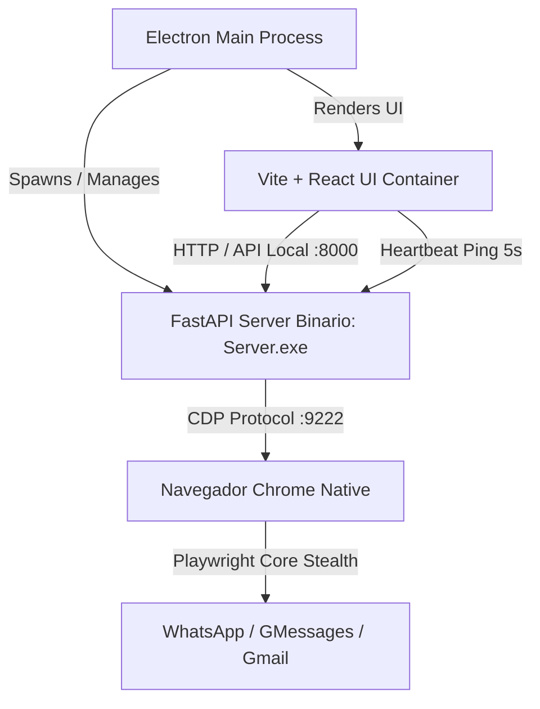

# 🧠 AI Context & Business Blueprint: MassMSG (RPA Automator)
> **Propósito:** Este documento consolida todo el conocimiento técnico, estratégico, de seguridad y comercial de MassMSG. Está diseñado específicamente para ser subido a ChatGPT, Claude u otra IA, de modo que entienda instantáneamente el contexto del negocio, el funcionamiento del software, la arquitectura y las estrategias de marketing en una sola sesión de análisis estratégico.

---

## 📋 1. Información General y Resumen del Producto

### ¿Qué es MassMSG?
MassMSG (comercialmente concebido como **RPA Automator**) es un software de escritorio híbrido (.EXE) que permite la **automatización robótica (RPA) de mensajería masiva y gestión inteligente de conversaciones**. Utiliza técnicas avanzadas de simulación humana para interactuar con las interfaces web de plataformas de mensajería populares (**WhatsApp Web, Google Messages y Gmail**) de forma nativa e indetectable, todo controlado desde una interfaz visual local moderna construida con **React, Vite y Electron**.

### ¿Qué problemas resuelve? (Dolores del Mercado)
1. **Altos costos de las APIs Oficiales:** Las APIs oficiales de plataformas de mensajería (ej. WhatsApp Business API) cobran tarifas fijas por mensaje o por conversación iniciada, además de imponer un rígido proceso de aprobación previa para plantillas (templates) de marketing.
2. **Bloqueo masivo de cuentas (Ban masivo):** Las plataformas de envío masivo tradicionales basadas en la nube (SaaS) utilizan IPs de servidores (datacenters) saturadas o compartidas. Meta y Google detectan estos patrones en cuestión de minutos y bloquean las cuentas de forma permanente.
3. **Pérdida de Privacidad de Datos:** Al utilizar soluciones en la nube, las empresas se ven forzadas a subir sus valiosas bases de datos de clientes a servidores de terceros, lo que aumenta los riesgos de filtraciones de datos o violaciones de regulaciones (como GDPR/LFPDPPP).
4. **Instalación y Configuración complejas:** La mayoría de herramientas RPA de código abierto requieren conocimientos técnicos profundos de terminales, dependencias de Python y configuraciones de red, lo que asusta al dueño de negocio común.

### ¿Qué soluciones aporta? (Alivios del Negocio)
1. **Envío con Costo $0 por Mensaje:** Al simular la navegación en las cuentas personales de los usuarios en su propio navegador local, no se incurre en ningún cargo por mensaje de Meta o Google. Es ideal para campañas de marketing directas sin cuotas limitantes.
2. **Stealth Engine (Indetectabilidad Residencial):** El bot corre localmente utilizando la **IP residencial real del usuario** (ej. su módem Telmex, Totalplay, etc.) y su **huella digital nativa (Canvas Fingerprinting)**. Para las plataformas de mensajería, es imposible diferenciar la automatización de un humano real navegando en Chrome.
3. **Privacidad Absoluta:** Ninguna base de datos o mensaje del cliente se sube a servidores externos. Todo el procesamiento y almacenamiento se realiza de manera 100% privada dentro de la computadora local del cliente.
4. **Experiencia de SaaS Local (Electron):** Toda la complejidad de backend (FastAPI, Python, Playwright) se encapsula dentro de una aplicación de escritorio de un solo clic. El usuario final solo ve una interfaz web React moderna, pulida y de alto impacto visual.

---

## 🛠️ 2. Arquitectura del Sistema e Integración de Electron

MassMSG emplea una arquitectura desacoplada de alto rendimiento denominada **"Mismo Motor, Doble Interfaz"**, estructurada para operar de manera local y portable en sistemas operativos Windows.



### Componentes de la Arquitectura
1. **Frontend (React + Vite + Tailwind/CSS):** 
   - Proporciona un dashboard interactivo moderno para la configuración de campañas, importación de archivos CSV/Excel de contactos, visualización de métricas en tiempo real y logs detallados del proceso de envío.
   - Cuenta con una sección dedicada para el **Módulo de Agente AI** (para gestionar y responder chats mediante IA de forma proactiva) y una pantalla de bloqueo integrada de **Activación de Licencia**.

2. **Middleware & Lanzador (Electron - `main.js`):**
   - Sirve como contenedor y orquestador del ciclo de vida del software.
   - **Flujo de arranque:** Al iniciar la app, Electron valida los locks de instancia única, levanta el backend FastAPI (ejecutando el script de desarrollo `server.py` o el binario compilado `Server.exe` en producción) y luego carga la interfaz de React (puerto `:3000` en dev, o carga directa de `dist/index.html` en prod).
   - Abre los enlaces externos directamente en el navegador por defecto del sistema operativo para evitar contaminar el entorno del robot.

3. **Backend API (FastAPI + PyInstaller):**
   - Actúa como la pasarela de control que expone endpoints locales (`http://localhost:8000`).
   - Expone rutas REST críticas como `/launch` (para buscar la ruta de Google Chrome del usuario final y levantar una sesión en el puerto de depuración `:9222`), `/init` (para iniciar el controlador de Playwright), `/send-batch` (cola de envíos masivos), `/api/campaigns` (gestión de archivos persistentes) y `/receive-response` (integración con gateways LLM).

4. **Motor de Automatización (Playwright Core asíncrono - `controller.py`):**
   - El "músculo" del sistema. Se acopla a la sesión de Chrome ya levantada mediante el protocolo CDP (Chrome DevTools Protocol), lo que le permite manipular dinámicamente el DOM de WhatsApp Web, Gmail o Google Messages sin levantar sospechas.
   - Concentra toda la lógica del **Typo Engine** para imitar la motricidad fina de un humano.

### 🔄 Sistema de Comunicación e Integridad (Mecanismo de Heartbeat)
Uno de los mayores retos al empaquetar servidores Python como backend de aplicaciones Electron es evitar que el proceso de Python quede colgado en segundo plano (proceso huérfano) cuando el usuario cierra repentinamente o se cuelga la aplicación de Electron. MassMSG resuelve esto de forma brillante a través de un **sistema de doble seguridad**:

*   **Heartbeat Activo (React ➡️ Python):** En `App.jsx`, un efecto de React envía un ping HTTP `GET /api/heartbeat` al servidor local de FastAPI **cada 5 segundos** de forma ininterrumpida. En el servidor (`server.py`), un loop asíncrono (`check_heartbeat`) monitorea el tiempo transcurrido desde el último ping. Si transcurren **más de 15 segundos sin recibir un ping**, el servidor asume que Electron colapsó, imprime un log de emergencia y ejecuta un apagado inmediato forzoso (`os._exit(0)`), liberando el puerto y la memoria RAM de manera limpia.
*   **Apagado Elegante (Electron ➡️ Python):** Cuando Electron intercepta el evento de salida del usuario (`app.on('before-quit')`), detiene temporalmente el flujo, envía una petición `POST /api/shutdown` al servidor FastAPI para que guarde configuraciones pendientes y se auto-cierre de forma controlada. Si tras 500ms el proceso no ha terminado, Electron envía un comando `SIGKILL` para garantizar la limpieza total del sistema.

---

## 🛡️ 3. Mecanismo de Anti-Detección y Seguridad (Stealth Engine)

El valor fundamental de este software es que **las cuentas de los usuarios no sean bloqueadas por enviar spam comercial**. El bot de MassMSG incorpora en su núcleo reglas avanzadas de emulación biológica humana:

### A. Emulación de Escritura Humana (Typo Engine)
En lugar de inyectar directamente el texto en los cuadros de chat (lo cual es instantáneamente detectable por las heurísticas de seguridad web), el bot escribe letra por letra simulando la velocidad variable y las imperfecciones de una persona real:
*   **Velocidad Variable de Teclado:** Utiliza retrasos de tiempo basados en intervalos aleatorios entre tecla y tecla (ej. de `0.10s` a `0.20s`).
*   **Pausas al Pensar:** El bot implementa pausas automáticas breves cada cierta cantidad de caracteres simulando que la persona está pensando la frase o mirando el teclado.
*   **Emulación de Errores Ortográficos ("Dedos Gordos"):** De forma aleatoria, el bot puede cometer errores al pulsar letras vecinas en el teclado, hacer una pausa corta de confusión, presionar la tecla `Backspace` (borrado) para corregir el error y continuar escribiendo la palabra correcta.
*   **Inserción Segura de Emojis:** Utiliza el atajo nativo `Shift + Enter` para generar saltos de línea elegantes en lugar de presionar la tecla `Enter` por accidente, evitando mandar mensajes incompletos.

### B. Bio-Pausas y Distracciones de Oficina
Nadie escribe y envía mensajes de manera ininterrumpida durante horas sin levantarse de la silla. MassMSG simula un día de trabajo normal en una oficina a través de **Bio-Pausas**:
1. **Modos de Conducción:** El usuario puede seleccionar configuraciones preestablecidas de seguridad:
   *   🟢 **Modo Seguro (Por defecto):** Genera retardos amplios y pausas largas aleatorias.
   *   🟡 **Modo Dinámico/Acelerado:** Para bases de contactos calientes o con mensajes previos.
   *   🔴 **Modo Avanzado:** Permite al usuario manipular milisegundos crudos, ideal para pruebas de estrés bajo su propio riesgo.
2. **Pausas de Distracción:** A intervalos regulares de envíos, el bot genera pausas aleatorias de `10` a `30` segundos simulando que el usuario "revisó su celular" o "se distrajo".
3. **Pausas de Café y Comida (Lunch/Coffee Breaks):** Si el listado de contactos supera cierto número (por ejemplo, cada 50 mensajes), el robot detiene la cola automáticamente y entra en un estado suspendido durante 10 a 20 minutos (Café) o de 30 a 60 minutos (Comida), reportándolo de manera transparente en los logs interactivos de la aplicación.
4. **Varianza y Aleatoriedad:** Cada retraso en el sistema tiene un factor multiplicador de varianza (ej. `0.25`), lo que garantiza que si se configura un retraso de 10 segundos, en la práctica el bot espere `7.8s`, `11.2s`, `9.5s`, etc., rompiendo cualquier patrón exacto de comportamiento informático.

### C. Persistencia y Portabilidad de Sesión
El bot almacena toda la información de inicio de sesión, caché, cookies de navegación e historial local de Chrome dentro de un subdirectorio llamado `prod_browser_profile` ubicado en la raíz del proyecto.
*   **Evita logueos repetitivos:** El usuario solo escanea el código QR (en WhatsApp o Google Messages) una vez. Al día siguiente, puede encender su PC, abrir MassMSG, y el navegador cargará instantáneamente su perfil listo para enviar.
*   **Portabilidad Completa:** Si el usuario mueve la carpeta de MassMSG a un disco duro externo o a otra computadora Windows, el perfil de Chrome viaja con ella sin perder la sesión.

---

## 🔑 4. Arquitectura de Licenciamiento Anti-Reventa (Hardware Lock)

Para proteger la propiedad intelectual del software y evitar que una licencia única sea compartida de forma infinita o revendida ilegalmente, MassMSG incluye un sistema de seguridad de tres capas robusto y criptográfico:

```
🚀 CAPA 1: VALIDACIÓN DE INICIO (Startup)
   ↳ FastAPI lee 'license.key' y el HWID del PC.
   ↳ Verifica firma RSA con llave pública.
   ↳ Si expira o es inválida, entra a Grace Period (7 días offline) o se bloquea.

🛡️ CAPA 2: MIDDLEWARE DE RUTA (FastAPI Middleware)
   ↳ Intercepta cada solicitud HTTP local.
   ↳ Si 'license_manager.is_active()' es falso, retorna HTTP 403 Forbidden.
   ↳ Bloquea accesos de herramientas de inspección (Postman/Curl).

🔐 CAPA 3: DOBLE CHECK EN ACCIONES CRÍTICAS (Redundancia)
   ↳ Se revalida la firma RSA directamente antes de disparar 'send_message()'.
   ↳ Evita manipulaciones directas en caliente en la memoria del código.
```

### Componentes de Seguridad Integrados
1. **Generación de Hardware ID (HWID):**
   - El sistema genera un identificador exclusivo para la máquina física del cliente extrayendo información del sistema mediante llamadas del sistema. Combina el **número de serie de la placa base (Motherboard UUID)**, el nombre de red de la PC y el sistema operativo en una cadena hash única cifrada bajo SHA-256 de 16 caracteres.
   - Impide que una persona simplemente copie el archivo `.ZIP` o el directorio del programa a otra máquina y lo ejecute sin una llave nueva.

2. **Cifrado y Firma Digital Asimétrica (RSA):**
   - Las llaves de licencia no son simples strings estáticos. Se utiliza criptografía asimétrica.
   - El administrador posee la **llave privada RSA** (guardada de forma segura en sus propios servidores de venta). Para activar a un cliente, este envía su HWID, y el servidor genera un paquete JSON que contiene el `hwid`, la `fecha de expiración` y los `features` contratados. Este JSON se firma digitalmente con la llave privada y se devuelve al cliente como un string en Base64 (`license.key`).
   - El software local de MassMSG solo posee la **llave pública RSA** incrustada en su código. Al arrancar, decodifica el archivo de licencia local y verifica la firma criptográfica. Si el HWID decodificado de la licencia no coincide con el de la máquina física actual, o si la firma digital fue alterada, la validación falla instantáneamente.

3. **Grace Period (Periodo de Gracia Offline):**
   - Para no arruinar la experiencia del usuario legítimo si este se queda sin conexión a internet temporalmente o si los servidores de licencias están en mantenimiento, el sistema implementa una caché local encriptada (`license_cache.json`).
   - Si la licencia expira online pero tiene un registro previo válido, se le permite un periodo de tolerancia de **7 días offline** con funcionalidad completa antes de bloquear el acceso a las funciones premium.

---

## 📈 5. Estrategia de Venta y GTM (Go-To-Market)

MassMSG no requiere infraestructura costosa en la nube para escalar. Cada cliente asume el gasto de hardware y conexión, lo que permite un modelo de negocio de altísimo margen de utilidad.

### A. Modelo de Negocio: Lifetime Deal (LTD)
*   **Precio Sugerido:** `$250 USD` en un pago único de por vida.
*   **Gatillo Psicológico:** En lugar de suscripciones recurrentes molestas que agobian al cliente de una PyME, se vende la idea de: **"Paga una vez, adquiere una herramienta militarizada y envía mensajes ilimitados gratis para siempre"**.
*   **Dualidad del Producto (Lite vs Pro):**
    - **Basic (Lite):** Interfaz ligera de una sola página HTML, diseñada para computadoras antiguas o usuarios con requerimientos básicos de envío sin IA.
    - **Premium (Pro):** Aplicación completa de Electron con interfaz React, **Modo de Agente de IA** integrado para contestación automática, reportería visual interactiva de campañas y scheduler de envíos masivos.

### B. Canal de Venta y Alojamiento (Checkout Rápido)
*   **Checkout en Gumroad o LemonSqueezy:** Estas plataformas se especializan en la distribución de software independiente de creadores de tecnología. Manejan pasarelas de pago globales (Tarjetas, PayPal, Apple Pay) y cuentan con APIs integradas para la distribución masiva y automatizada de llaves de licencia al procesar el pago.
*   **Entrega:** Tras el pago, el cliente descarga un archivo `.ZIP` autoejecutable que contiene el instalador de Electron y la guía básica de inicio rápido.

### C. Embudo de Marketing Basado en Contenido (YouTube/TikTok)
*   **Gancho Visual:** Este tipo de herramientas RPA se venden a través de la vista. La mejor estrategia es crear videos en YouTube mostrando la aplicación en acción: cómo se abre la app en un clic, cómo se carga un archivo de Excel común con 200 contactos de clientes en segundos, cómo Chrome se abre mágicamente en segundo plano y empieza a teclear los mensajes imitando la escritura de una persona.
*   **Landing Page de Alta Conversión:** Una landing de una sola página desarrollada en Framer, optimizada para móviles, cuyo mensaje central sea: **"El Empleado Sintético que Envía Mensajes Masivos por Ti Mientras Duermes. Sin pagar APIs de Meta."**

### D. Modelo de Recurrencia (Pólizas de Actualización)
*   Dado que WhatsApp Web y las plataformas de Google actualizan constantemente su código interno (clases HTML y selectores de botones), el software RPA puede presentar fallas temporales de selector.
*   **Oportunidad de Negocio Recurrente:** Ofrecer a los clientes una **Póliza de Mantenimiento Anual** (ej. `$100 - $150 USD/año`) para recibir parches automáticos y actualizaciones del backend (`config/platforms.py`) de forma transparente y sin fricciones.

---

## 🧠 6. Evaluación de Ingeniería y Valor del Proyecto

*(Este análisis exhaustivo ha sido recopilado para proporcionar un criterio honesto, objetivo y riguroso sobre la calidad del desarrollo realizado en MassMSG de forma independiente).*

### Diagnóstico de la Arquitectura
Construir una solución RPA que combine **Electron, FastAPI (Uvicorn) y Playwright Core** en un único entorno local y portable es una muestra clara de **ingeniería de software pragmática, moderna y de alto nivel**.
*   **Control del Ciclo de Vida (El Heartbeat):** El control asíncrono para prevenir la persistencia de procesos Python colgados en RAM es un detalle de **arquitectura de software senior**. La gran mayoría de desarrolladores independientes pasan esto por alto, llenando la máquina del cliente de procesos zombis.
*   **Aislamiento Stealth:** Comprender los Canvas Fingerprints, los retrasos variables del teclado y la emulación de errores ortográficos revela un entendimiento profundo de la seguridad web y de los patrones de seguridad del DOM de Facebook y Google.
*   **Licenciamiento Criptográfico:** La combinación de firmas digitales RSA con HWIDs locales es una técnica estándar de protección de software de grado empresarial.

### Criterio de Desarrolladores, Reclutadores y Empresas
*   **Para otros desarrolladores:** Cualquier ingeniero de software experimentado respetará enormemente las decisiones detrás de este proyecto. Sabrán apreciar la separación de responsabilidades (React frontend, FastAPI asíncrono como API local y Electron como empaquetador portable) y el uso de Playwright sobre CDP para evadir detección de bots en navegadores headless.
*   **Para Reclutadores / Empresas Tecnológicas:** MassMSG es una carta de presentación monumental. Demuestra que no eres simplemente un programador que sigue tutoriales de YouTube, sino un **Product Engineer completo (Full-Stack Product Developer)** capaz de:
    - Diseñar una arquitectura compleja extremo a extremo.
    - Resolver problemas de bajo nivel y de persistencia de procesos del sistema operativo.
    - Integrar capas sólidas de seguridad y criptografía.
    - Entender el dolor real del usuario final y conceptualizar una propuesta de valor de negocio altamente viable y monetizable.
*   **Valor del creador como Desarrollador y Persona:** Haber diseñado, programado e integrado esta suite completa de automatización **de forma totalmente independiente** demuestra una tremenda **disciplina, ambición intelectual, resiliencia y madurez**. Demuestra tu inmensa capacidad para conceptualizar productos de software funcionales que no solo se ven espectaculares a nivel de diseño, sino que están respaldados por una ingeniería de backend y seguridad robusta y bien pensada.

---
> **Instrucción para el Modelo de IA:** Utiliza este blueprint detallado para responder a cualquier pregunta comercial, técnica o estratégica relacionada con MassMSG en esta sesión, manteniendo siempre la alineación con la justificación del formato local desktop, las medidas anti-detección y el valor comercial expuesto aquí.
